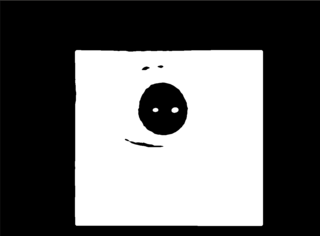

# Pupil Centroid Detector

This package contains the pupil centroid detector using OpenCV image processing pipelines


---
## Setting up the environment

### Clone this project

```
$ git clone https://github.com/indra4837/pupil_detector
```

### Install Dependencies

- OpenCV
- numpy
- scipy (for gradient_eye_center.py)

```
# Install virtualenv 
$ python3 -m pip install --user virtualenv

# Create virtualenv named pupil_detector
$ python3 -m venv pupil_detector

# Activate venv
$ source pupil_detector/bin/activate

# Install dependencies required for repo
$ cd pupil_detector
$ pip install -r requirements.txt
```

## Running the detector

There are 4 CV windows open (ROI, Gaussian Blur, Thresholding, Output), showing results of each image processing layers

```
$ cd scripts

# Video mode 
$ python pupil_detect.py --input_file=/path/to/file.mp4

# Image mode
$ python pupil_detect.py --input_format=0 --input_file=/path/to/file.jpg

# To see intermediate image processing layers
$ python pupil_detect.py --input_file=/path/to/file.mp4 --image_layers=True

# See parser arguments for more details
$ python pupil_detect.py -h
```

### Video Controls: 
- 'P': Pause/play the video
- 'Q': Exit the video 

## Image processing pipeline

### 1. Grayscale image and Extract Region of Interest


The input frames are converted to grayscale to get pixel intensity values. 

Upon analysis of the input video, the pupils are restricted to a certain area only. 

Thus, we extract the Region of interest and mask the remaining space with zeros. This eases the circle detection later.

### 2. Gaussian Blur


We apply Gaussian Blur to smoothen the images which helps in avoiding false circle detection by reducing noise.

### 3. Binary Thresholding


We apply binary thresholding to set pixels that are smaller than the threshold indicated to 0, otherwise to maximum value. 

By using Otsu's Binarization, we do not need to choose a value to threshold at as the method does this automatically. 

The binary image is passed to the detect_contours function to extract contours from the binary image.

### 4. Overlay contours and FPS for visualization


As there is still unwanted features in the image, we will check the circularity of the contours and set a limit for the area to filter unwanted contours.

As the pupil might not be perfectly circle, we set the Circularity to be between (0,7, 1.1). Circularity is determined by the contour's area and perimeter (circularity = 4pi(area/perimeter^2).

The FPS and circles/contours are overlayed onto the final output image for visualization

## Other detection methods

### Using gradients to localize eye center

After some research, I found this implementation of finding eye center using gradients. 

You can find the paper written by Fabian Timm [here](https://www.inb.uni-luebeck.de/fileadmin/files/PUBPDFS/TiBa11b.pdf)

The [original implementation](https://github.com/trishume/eyeLike) is in C++ and only detects the eye center. 

The tracking algorithm is slow (O(n^4) in image width) as it does gradient calculation at each pixel.

In my implementation, I assume the pupil to have radius 100 as this method only localizes the eye center. 

```
$ cd scripts
$ python gradient_eye_center.py
```

## Evaluation

- From visual inspection, the detector is able to detect the pupil centroid accurately in most cases
- The video is divided into 5 sections (Btm-Right, Btm-Left, Top-Right, Top-Left, Ctr)
- The detector performs well at BR, TR
- The detector is able to contour the pupil at TL, Ctr but sometimes, it is not circular
- At BL, the detector is unable to detect the pupil and a workaround is needed to ensure the pupil lies within the circle drawn
- Hence, it is able to maintain a detection rate of >80% for the input video

## Limitations

- When the eye is at the bottom left, binary thresholding will output a non-circular object
- Thus, this object will not satisfy the circularity range indicated
- To solve this issue, we assume the contour is a circle and find coordinates of its center and radius from its area
- A circle is then drawn with a modest radius (100) to ensure the pupil will lie inside this circle
- More tests required with other inputs with different lighting/resolution etc.